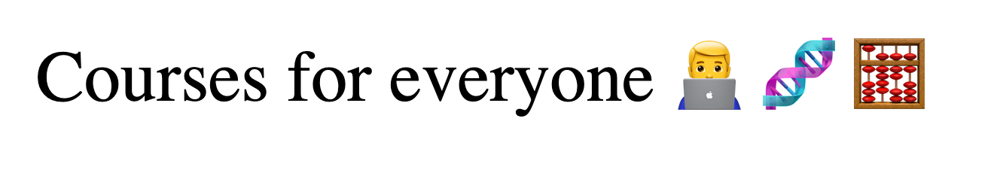

# Courses API
<p align="center">
Implemented a server to send course information. The API will handle the HTTP GET, POST and DELETE methods.


##



## Get Started


1. Clone this repository and run:
```sh
npm install
npm install nodemon
```
2. Run the server:
```sh
nodemon app.js
```
